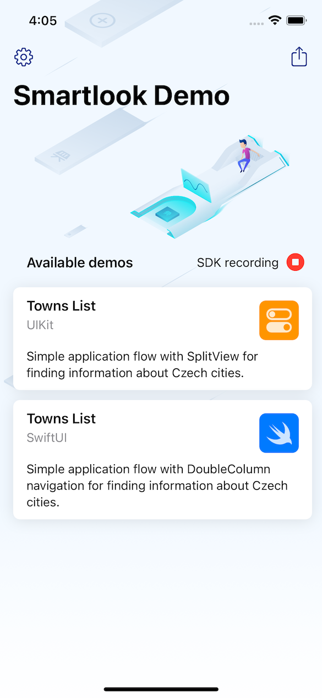
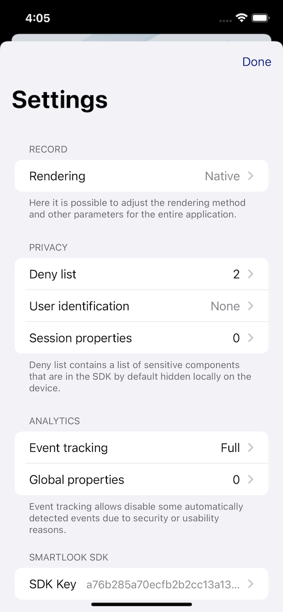
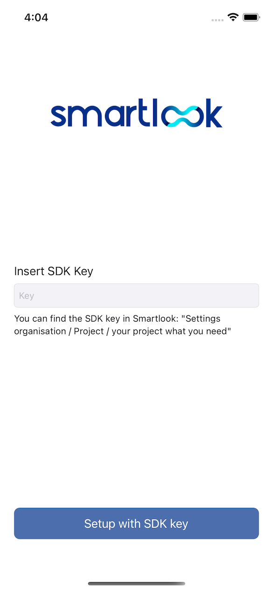

# Smartlook Demo for iOS

It serves as a tool for developers and teams that would like to deploy Smartlook in their application. With this app, they can try out all the key features without having to integrate the SDK into their own application. Everything is already ready and available for immediate use.

**What is the demo for?**
- A quick pre-made package to try out the SDK.
- A reference demonstration of how to implement and use the SDK features.
- For switching between different recording modes.
- For generating sample recordings.

**Who is it for?**
- Application developers (to study usage and as a starting point for further testing).
- For anyone who is thinking about deploying the technology and would like to try it on their device.

**What else does it do?**
- Demonstrates the use of the [Smartlook Consent SDK](https://github.com/smartlook/ios-consent-sdk) in a real application.

## Minimum requirements

iOS 14.0, Xcode 12.4, compatible iPhone, iPad or Simulator

## Prerequisites

A valid Smartlook account with an established project for the mobile app. Free account can also be used. See [Smartlook.com](https://www.smartlook.com/mobile-analytics/) for more information.

## Installation
### SDK key definition (optional)

If you don't want to enter the SDK key the first time you launch the app (which can be inconvenient in some situations), you can define it directly by entering it in the app source code. The key thus entered can be changed later in the application settings.

Update the `smartlookApiKey` constant at the beginning of the `AppDelegate.swift` file by specifying your SDK key.

### Without an explicit SDK key definition (default)
If you do not specify `smartlookApiKey` constant, the application will prompt for it during the first launch.

## License

Smartlook Demo is released under the MIT license.
